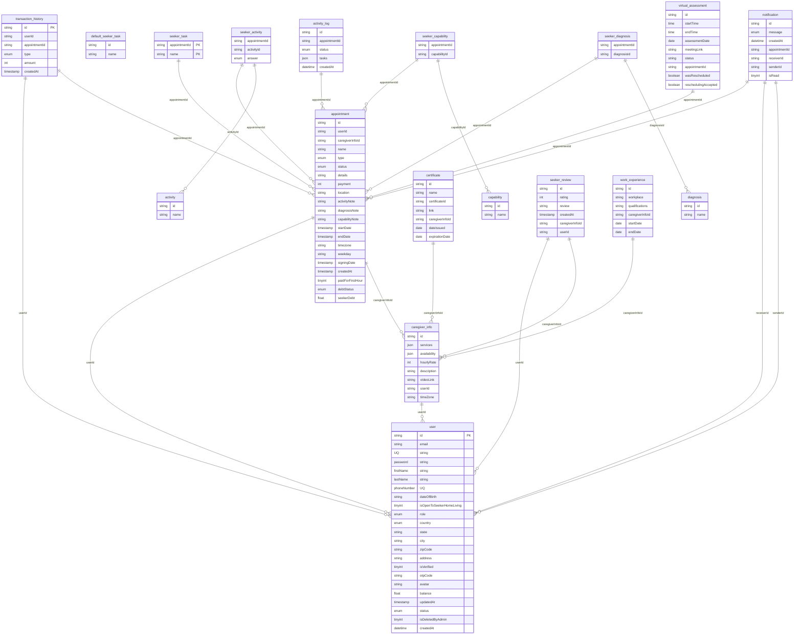

# CTRLCHAMPS BACKEND

## Installation

```bash
 $ npm install
```

## Running the app

```bash
$ npm run dev
```

**Do not forget to setup configuration files (.env)**

**Environmental variables:**

## Database

These are the configurations for the database connection.

- `DATABASE_USERNAME`: The username for the database.
- `DATABASE_PASSWORD`: The password for the database.
- `DATABASE_HOST`: The host of the database.
- `DATABASE_PORT`: The port of the database.
- `DATABASE_NAME`: The name of the database.

## App

These are the configurations for the application.

- `APP_PORT`: The port on which the application runs.
- `CORS_ORIGIN`: The origin allowed to make cross-origin requests.

## JWT

These are the configurations for JSON Web Tokens.

- `JWT_SECRET`: The secret key used to sign the tokens.
- `JWT_TOKEN_EXPIRE`: The duration after which the token expires.

## Crypt

These are the configurations for password encryption.

- `PASSWORD_SALT_ROUNDS`: The number of rounds for the salt.
- `ADMIN_DEFAULT_PASSWORD`: The default password for the admin.

## SendGrid

These are the configurations for the SendGrid service.

- `SENDGRID_API_KEY`: The API key for the SendGrid service.
- `SENDGRID_FROM_EMAIL`: The email address from which the emails are sent.
- `SENDGRID_OTP_TEMPLATE_ID`: The template ID for the OTP email.
- `SENDGRID_UPDATE_USER_PASSWORD_TEMPLATE_ID`: The template ID for the update password email.
- `SENDGRID_DELETE_USER_TEMPLATE_ID`: The template ID for the delete user email.
- `SENDGRID_CAREGIVER_TEMPLATE_ID`: The template ID for the caregiver email.
- `SENDGRID_SEEKER_TEMPLATE_ID`: The template ID for the seeker email.
- `SENDGRID_SEEKER_APPOINTMENT_TEMPLATE_ID`: The template ID for the seeker appointment email.
- `SENDGRID_CAREGIVER_APPOINTMENT_TEMPLATE_ID`: The template ID for the caregiver appointment email.
- `SENDGRID_INSUFFICIENT_APPOINTMENT_CREATION_BALANCE_TEMPLATE_ID`: The template ID for the insufficient balance email.
- `SENDGRID_REQUESTED_VIRTUAL_ASSESSMENT_TEMPLATE_ID`: The template ID for the requested virtual assessment email.
- `SENDGRID_ACCEPTED_VIRTUAL_ASSESSMENT_TEMPLATE_ID`: The template ID for the accepted virtual assessment email.
- `SENDGRID_REQUESTED_VIRTUAL_ASSESSMENT_RESCHEDULING_TEMPLATE_ID`: The template ID for the requested virtual assessment rescheduling email.
- `SENDGRID_ACCEPTED_VIRTUAL_ASSESSMENT_RESCHEDULING_TEMPLATE_ID`: The template ID for the accepted virtual assessment rescheduling email.
- `SENDGRID_REJECTED_VIRTUAL_ASSESSMENT_RESCHEDULING_TEMPLATE_ID`: The template ID for the rejected virtual assessment rescheduling email.
- `SENDGRID_ASSESSMENT_REMINDER_TEMPLATE_ID`: The template ID for the assessment reminder email.
- `SENDGRID_ALL_ADMINS_REJECTED_ACTIVITY_LOG_TEMPLATE_ID`: The template ID for the rejected activity log email.
- `SENDGRID_APPOINTMENT_REQUEST_ACCEPT_TEMPLATE_ID`: The template ID for the appointment request accept email.
- `SENDGRID_APPOINTMENT_REQUEST_REJECT_TEMPLATE_ID`: The template ID for the appointment request reject email.
- `SENDGRID_APPOINTMENT_REJECT_BY_CLIENT_TEMPLATE_ID`: The template ID for the appointment reject by client email.
- `SENDGRID_SEEKER_SUBMIT_CONTRACT_PROPOSAL_TEMPLATE_ID`: The template ID for the seeker submit contract proposal email.
- `SENDGRID_CAREGIVER_SUBMIT_CONTRACT_PROPOSAL_TEMPLATE_ID`: The template ID for the caregiver submit contract proposal email.
- `SENDGRID_SEEKER_ACCEPTED_RESCHEDULED_VIRTUAL_ASSESSMENT_TEMPLATE_ID`: The template ID for the seeker accepted rescheduled virtual assessment email.
- `SENDGRID_SEEKER_PAYMENT_REMINDER_TEMPLATE_ID`: The template ID for the seeker payment reminder email.
- `SENDGRID_ALL_ADMINS_PAYMENT_REMINDER_TEMPLATE_ID`: The template ID for the all admins payment reminder email.
- `SENDGRID_CAREGIVER_APPOINTMENT_PAUSED_TEMPLATE_ID`: The template ID for the caregiver appointment paused email.
- `SENDGRID_CAREGIVER_RESUME_APPOINTMENT_TEMPLATE_ID`: The template ID for the caregiver resume appointment email.
- `SENDGRID_NEW_SEEKER_REVIEW_TEMPLATE_ID`: The template ID for the new seeker review email.
- `SENDGRID_SEEKER_REVIEW_REMINDER_TEMPLATE_ID`: The template ID for the seeker review reminder email.

## Redirect Links

These are the URLs for different redirects in the application.

- `CAREGIVER_REDIRECT_LINK`: URL for the caregiver profile page.
- `SEEKER_REDIRECT_LINK`: URL for the seeker login page.
- `SEEKER_APPOINTMENT_REDIRECT_LINK`: URL for the seeker to create an appointment.
- `CAREGIVER_APPOINTMENT_REDIRECT_LINK`: URL for the caregiver's appointment page.
- `SEEKER_UPDATE_VIRTUAL_ASSESSMENT_STATUS_LINK`: URL for the seeker to update the status of a virtual assessment.

## AWS S3

These are the configurations for the AWS S3 service.

- `AWS_S3_REGION`: The region where the S3 bucket is located.
- `AWS_BUCKET_NAME`: The name of the S3 bucket.
- `ACCESS_ID`: The access ID for the AWS account.
- `AWS_SECRET_KEY`: The secret key for the AWS account.
- `AWS_FILES_STORAGE_URL`: The URL for the AWS files storage.




## Entities

### activity
- id: Unique identifier for the activity.
- name: Name of the activity.

### activity_log
- id: Unique identifier for the activity log.
- appointmentId: Identifier for the associated appointment.
- status: Status of the activity (enum).
- tasks: Tasks associated with the activity (json).
- createdAt: Date and time when the log was created.

### appointment
- id: Unique identifier for the appointment.
- userId: Identifier for the associated user.
- caregiverInfoId: Identifier for the associated caregiver.
- name: Name of the appointment.
- type: Type of the appointment (enum).
- status: Status of the appointment (enum).
- details: Details about the appointment.
- payment: Payment for the appointment.
- location: Location of the appointment.
- activityNote: Note about the activity.
- diagnosisNote: Note about the diagnosis.
- capabilityNote: Note about the capability.
- startDate: Start date and time of the appointment.
- endDate: End date and time of the appointment.
- timezone: Timezone of the appointment.
- weekday: Weekday of the appointment.
- signingDate: Date and time when the appointment was signed.
- createdAt: Date and time when the appointment was created.
- paidForFirstHour: Whether the first hour has been paid for (tinyint).
- debtStatus: Debt status of the appointment (enum).
- seekerDebt: Debt of the seeker.

### capability
- id: Unique identifier for the capability.
- name: Name of the capability.

### caregiver_info
- id: Unique identifier for the caregiver info.
- services: Services provided by the caregiver (json).
- availability: Availability of the caregiver (json).
- hourlyRate: Hourly rate of the caregiver.
- description: Description of the caregiver.
- videoLink: Video link of the caregiver.
- userId: Identifier for the associated user.
- timeZone: Timezone of the caregiver.

### certificate
- id: Unique identifier for the certificate.
- name: Name of the certificate.
- certificateId: Identifier for the certificate.
- link: Link to the certificate.
- caregiverInfoId: Identifier for the associated caregiver info.
- dateIssued: Date when the certificate was issued.
- expirationDate: Expiration date of the certificate.

### default_seeker_task
- id: Unique identifier for the default seeker task.
- name: Name of the default seeker task.

### diagnosis
- id: Unique identifier for the diagnosis.
- name: Name of the diagnosis.

### notification
- id: Unique identifier for the notification.
- message: Message of the notification (enum).
- createdAt: Date and time when the notification was created.
- appointmentId: Identifier for the associated appointment.
- receiverId: Identifier for the receiver of the notification.
- senderId: Identifier for the sender of the notification.
- isRead: Whether the notification has been read (tinyint).

### seeker_activity
- appointmentId: Identifier for the associated appointment.
- activityId: Identifier for the associated activity.
- answer: Answer for the activity (enum).

### seeker_capability
- appointmentId: Identifier for the associated appointment.
- capabilityId: Identifier for the associated capability.

### seeker_diagnosis
- appointmentId: Identifier for the associated appointment.
- diagnosisId: Identifier for the associated diagnosis.

### seeker_review
- id: Unique identifier for the seeker review.
- rating: Rating given in the review.
- review: Text of the review.
- createdAt: Date and time when the review was created.
- caregiverInfoId: Identifier for the associated caregiver info.
- userId: Identifier for the associated user.

### seeker_task
- appointmentId: Identifier for the associated appointment (Primary Key).
- name: Name of the task (Primary Key).

### transaction_history
- id: Unique identifier for the transaction history (Primary Key).
- userId: Identifier for the associated user.
- appointmentId: Identifier for the associated appointment.
- type: Type of the transaction (enum).
- amount: Amount of the transaction.
- createdAt: Date and time when the transaction was created.

### user
- id: Unique identifier for the user (Primary Key).
- email: Email of the user (Unique).
- password: Password of the user.
- firstName: First name of the user.
- lastName: Last name of the user.
- phoneNumber: Phone number of the user (Unique).
- dateOfBirth: Date of birth of the user.
- isOpenToSeekerHomeLiving: Whether the user is open to seeker home living (tinyint).
- role: Role of the user (enum).
- country: Country of the user (enum).
- state: State of the user.
- city: City of the user.
- zipCode: Zip code of the user.
- address: Address of the user.
- isVerified: Whether the user is verified (tinyint).
- otpCode: OTP code for the user.
- avatar: Avatar of the user.
- balance: Balance of the user.
- updatedAt: Date and time when the user was last updated.
- status: Status of the user (enum).
- isDeletedByAdmin: Whether the user is deleted by admin (tinyint).
- createdAt: Date and time when the user was created.

### virtual_assessment
- id: Unique identifier for the virtual assessment.
- startTime: Start time of the assessment.
- endTime: End time of the assessment.
- assessmentDate: Date of the assessment.
- meetingLink: Meeting link for the assessment.
- status: Status of the assessment.
- appointmentId: Identifier for the associated appointment.
- wasRescheduled: Whether the assessment was rescheduled.
- reschedulingAccepted: Whether the rescheduling was accepted.

### work_experience
- id: Unique identifier for the work experience.
- workplace: Workplace of the work experience.
- qualifications: Qualifications of the work experience.
- caregiverInfoId: Identifier for the associated caregiver info.
- startDate: Start date of the work experience.
- endDate: End date of the work experience.

## Relationships
- activity_log is related to appointment via appointmentId.
- appointment is related to user via userId.
- appointment is related to caregiver_info via caregiverInfoId.
- caregiver_info is related to user via userId.
- certificate is related to caregiver_info via caregiverInfoId.
- notification is related to appointment via appointmentId.
- notification is related to user via receiverId and senderId.
- seeker_activity is related to appointment via appointmentId and activity via activityId.
- seeker_capability is related to appointment via appointmentId and capability via capabilityId.
- seeker_diagnosis is related to appointment via appointmentId and diagnosis via diagnosisId.
- seeker_review is related to user via userId and caregiver_info via caregiverInfoId.
- seeker_task is related to appointment via appointmentId.
- transaction_history is related to user via userId and appointment via appointmentId.
- virtual_assessment is related to appointment via appointmentId.
- work_experience is related to caregiver_info via caregiverInfoId.